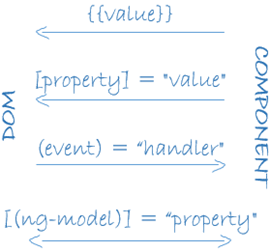

# Compte rendu de TP d'IHMW : Pokedex

L'objectif global de ce tp est de se familiariser avec les différentes mécaniques à prendre en main pour maîtriser les bases d'un framework web "moderne".
Lors de la réalisation de ce pokémon, il a été nécessaire d'utiliser différentes méthodes de databinding.

Ces différents principes nous ont d'ores-et-déjà été expliqués lors du cours avec M.Barais. C'est pourquoi je ne juge pas nécessaire de revenir dessus puisque la bonne réalisation du pokédex temoigne de ma connaissance sur le sujet.

Toutefois, il est bien plus intéressent je pense de raconter les problèmes que j'ai rencontrés et les solutions que j'ai trouvées pour y faire face.

## Introduction et organisation globale

Pour introduire ce compte rendu, je juge intéressant de montrer l'architecture de mon projet :

Pour ma part, j'ai choisi d'organiser mon interface et mon architecture de manière à imiter une carte pokémon :

J'ai ainsi choisi de créer un composant par "section" de carte pokémon. C'est pourquoi on y retrouve "abilities", "description", "specs" et "stats". Le composant "pokemon-card" permet d'organiser les composants précédents. Le composant id-input permet d'organiser les bindings et d'appeler les méthodes de requêtage http.

Ces fonctions sont crées dans un service surnommé "http-service". Celles-ci sont toutes et SEULEMENT appelés dans mon composant id-input.

Pour la gestion des données dans mon application, j'ai créé un service appelé "data" qui va gérer seulement les données. C'est dans celui-ci que sont créés les observables (utilisés pour rendre l'application dynamique par rapport aux données reçues de l'API pokeAPI).

### Mon application

Voici le rendu global de mon application, une fois en fonctionnement :

Pour obtenir des informations sur un pokémon, il suffit simplement de le sélectionner dans l'input/select en haut de l'application :

Pour le physique de mon application, j'ai choisi le framework "Angular Material", qui m'a fourni des composants "plus jolis" que les composants de base.
Remarquons que la couleur de la carte pokémon est en accord avec son type principal. Cela témoigne du fonctionnement de mon service de données et également du fonctionnement général de l'application.

## Les problèmes rencontrés

### Gestion de l'asynchronicité

Lors de la réalisation de mon application j'ai rencontré des problêmes liés à l'asynchronicité des requêtes http. En soit, mon application fonctionnait globalement, mais je trouvais pas mal d'erreurs dans ma console, signe que celle-ci n'était pas conçue de manière optimale. Pour y remédier, le principal mécanisme que j'ai utilisé est de rendre une promise dans mes fonctions d'appel http (je résolve la promise dans le callback de l'appel http). Ainsi, je pouvais les appeler dans ma fonction bindée par le bouton "Go" et effectuer le "then" sur la promise pour appeler un autre callback. C'est dans ce callback que j'appelle me fonction de subscribe à l'observable. 

De cette manière, il n'y a aucun risque d'effectuer un binding sur une donnée non définie ou définie "trop tard" à cause de l'asynchronicité.

### Organisation des données

Aussi, j'ai ressenti des difficultés pour organiser mes données. Par là, j'entends quelle structure de donnée utiliser, quand et dans quelles fonctions.
J'ai ainsi essayé de créer une architecture logique. Les squelettes des objets reçus par le getter http sont définis dans des interfaces réunies dans un fichier "interfaces". Ma structure de pokémon est définie dans la classe pokémon.

## Conclusion et ressenti général

J'ai trouvé ce tp très "ludique" à réaliser dans le sens où tout le monde connaît plus ou moins le monde des pokémons. Ainsi, on pouvait se parler entre étudiants des différentes features implémentées. Je l'ai également trouvé très formateur dans le sens où j'ai pu apprendre des mécanismes, une organisation et une architecture nécessaires à appréhender dans le développement web aujourd'hui.
